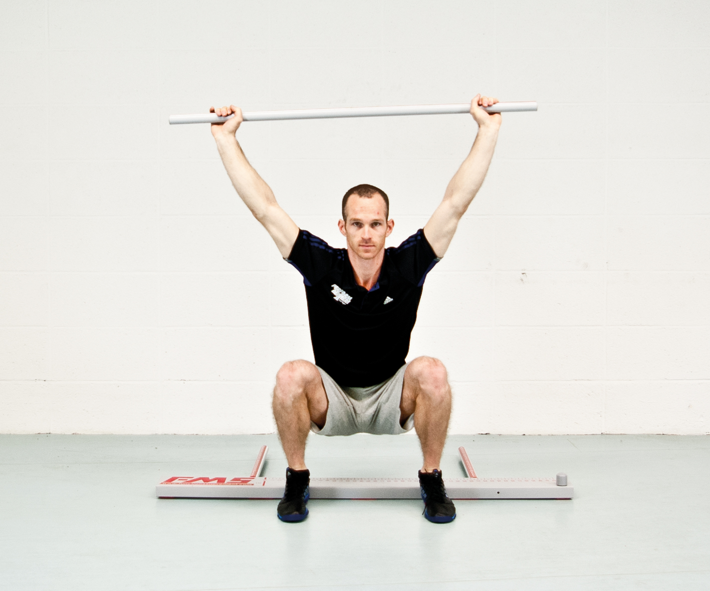
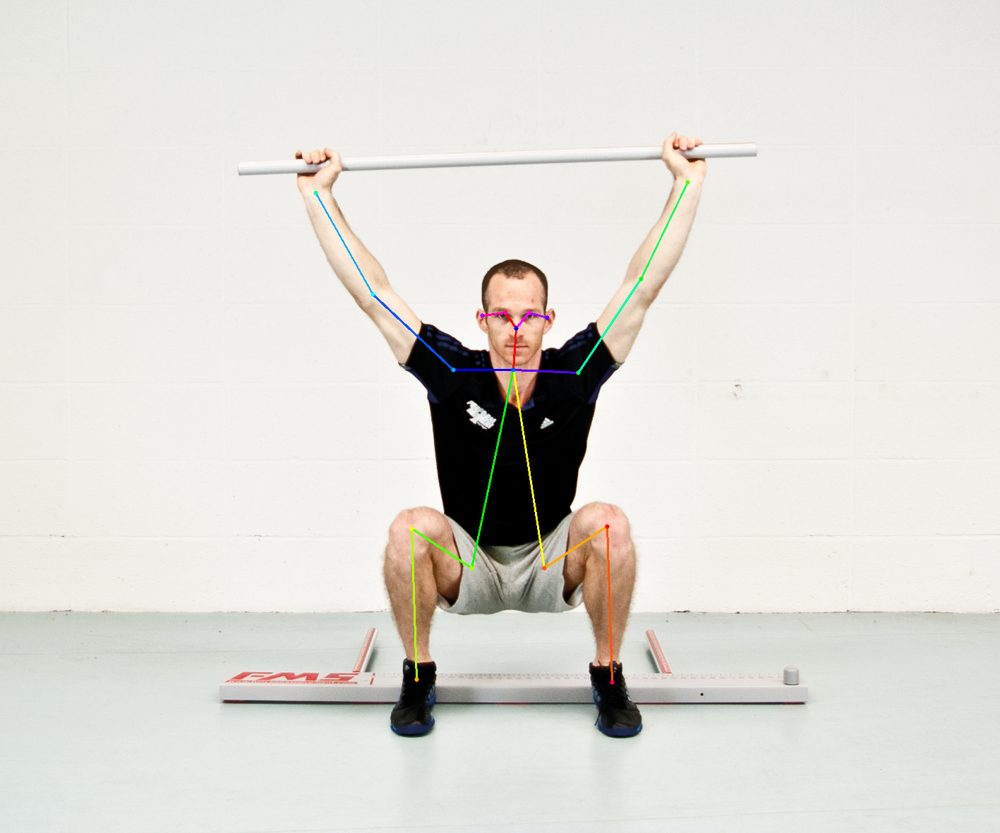
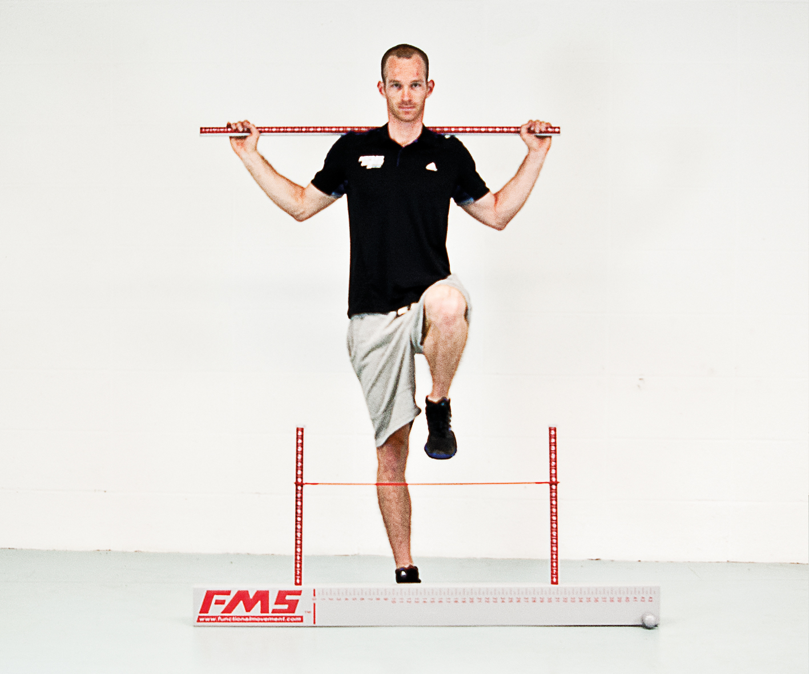
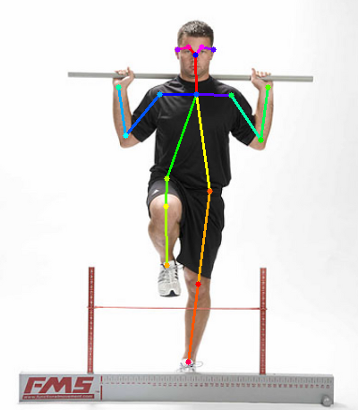
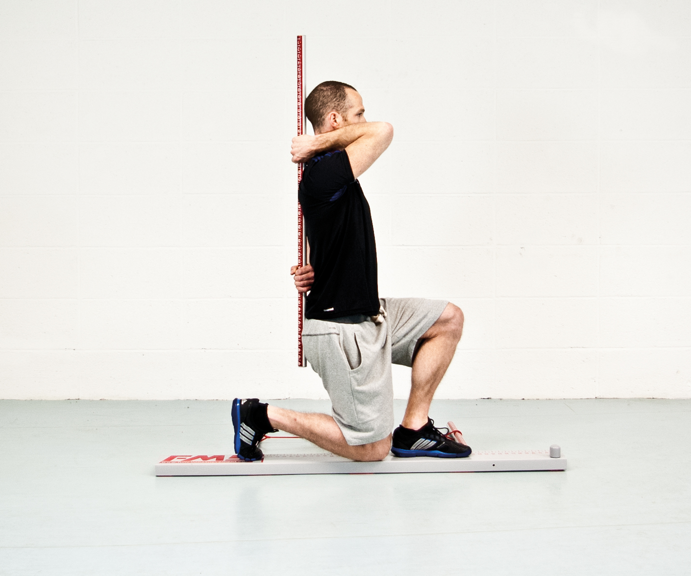
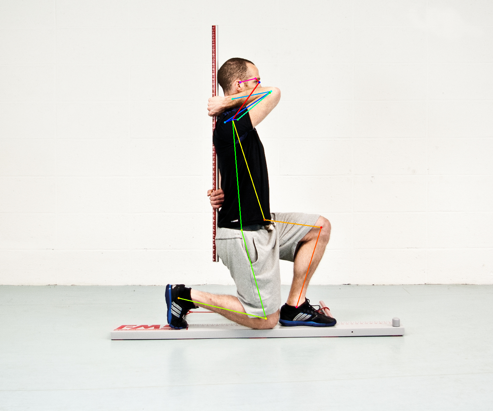
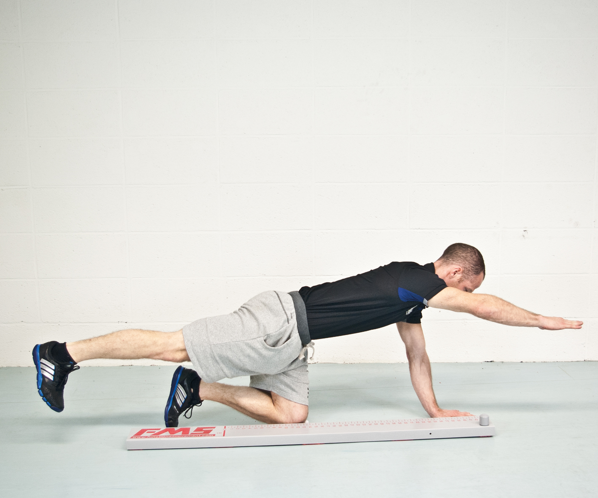
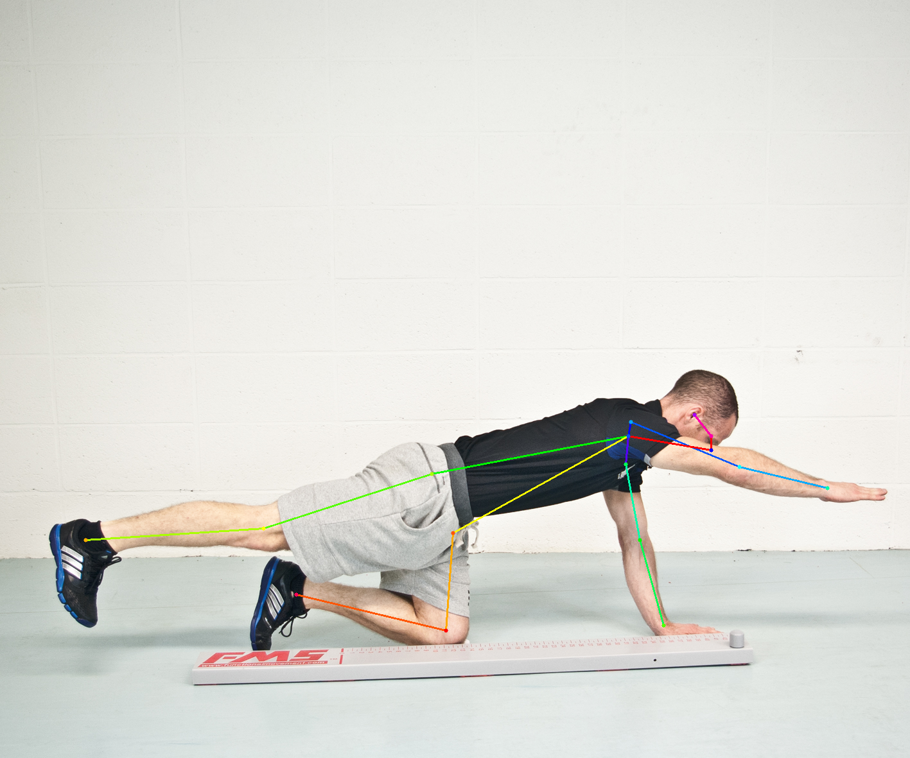

# Chainer Realtime Multi-Person Pose Estimation

[Realtime Multi-Person 2D Pose Estimation using Part Affinity Fields](https://arxiv.org/abs/1611.08050) 논문을 기반으로 FMS 동작(Deep Squat, Hurdle Step, In-line Lunge, Active Straight-leg Raise, Trunk Stability Push-up, Rotary Stability, Shoulder Mobility)을 인식해 FMS 점수에 유사한 평가지표를 만드는 목표에 앞서 동작을 인식하고 자세를 측정하는 모델을 구현해 본다.

## 차례
1. [Converting caffe model](#convert-caffe-model-to-chainer-model)
2. [Testing](#test-using-the-trained-model)
3. [FMS에 대해](#about-fms)

## Requirements

- Python 3.0+
- Chainer 2.0+
- NumPy
- Matplotlib
- OpenCV

## Convert Caffe model to Chainer model
[참조한 프로젝트](https://github.com/ZheC/Realtime_Multi-Person_Pose_Estimation)에서  caffe model을 참고하여 변환하면 된다.

```
> cd models
> wget http://posefs1.perception.cs.cmu.edu/OpenPose/models/pose/coco/pose_iter_440000.caffemodel
> wget http://posefs1.perception.cs.cmu.edu/OpenPose/models/face/pose_iter_116000.caffemodel
> wget http://posefs1.perception.cs.cmu.edu/OpenPose/models/hand/pose_iter_102000.caffemodel

> python convert_model.py posenet pose_iter_440000.caffemodel coco_posenet.npz
> python convert_model.py facenet pose_iter_116000.caffemodel facenet.npz
> python convert_model.py handnet pose_iter_102000.caffemodel handnet.npz
```

## Test using the trained model
우선 이미지 파일로 기존 trained model을 사용하여 동작이 제대로 인식되는지 평가해 본다.

```
> python pose_detector.py posenet models/coco_posenet.npz --images data/image/deep_squat.jpg data/image/hurdle_step.jpg data/image/in_line_lunge.jpg data/image/rotary_stability.jpg
```

gpu가 지원된다면 `--gpu` option을 사용하면 된다.

```
> python pose_detector.py posenet models/coco_posenet.npz --images data/image/deep_squat.jpg data/image/hurdle_step.jpg data/image/in_line_lunge.jpg data/image/rotary_stability.jpg --gpu 0
```

<div align="center">

&nbsp;

</div>

<div align="center">

&nbsp;

</div>

<div align="center">

&nbsp;

</div>

<div align="center">

&nbsp;

</div>

카메라가 지원되는 컴퓨터라면 실시간으로 동작을 인식하는 테스트를 할 수 있다. 그리고 동영상을 분석할 수 있다. 종료는 `q`를 누르면 된다.

```
> python video_pose_detector.py --video data/video/hurdle_step_video.mp4
```

<div align="center">

</div>

## About FMS
Cook에 의해 창안된 안정성과 가동성을 평가하기 위해 고안된 움직임 패턴 평가로 불균형(Imbalances)과 약점(Weaknesses)이 나타나는 극단적 자세를 사용하여 7가지의 움직임 패턴을 통해 관절의 제한사항, 불균형, 비대칭, 보상작용 등을  평가할 수 있는 검사 방법이다.

프로세스는 아래와 같다.

1. 7가지의 움직임 동작(Deep Squat, Hurdle Step, In-line Lunge, Active Straight-leg Raise, Trunk Stability Push-up, Rotary Stability, Shoulder Mobility)을 통해서 신체의 움직임의 기능적인 문제를 파악하고 점수를 채점하고,
2. 각 항목의 만점 기준은 3점이며,
3. 7가지 움직임 테스트 후 총 점수가 14점 이하인 경우, 신체의 문제점이 노출되어 있다고 판단할수 있으며 교정운동을 통해서 신체의 문제점을 개선한다.

*. FMS에서는 가동성과 안정성, 움직임 패턴을 확인할수 있다.
- 가동성 운동(ASLR, SM)은 관절의 움직임 범위, 조직의 길이와 근육의 유연성을 확인한다.
- 안정성 운동(TSPU,RS)은 각각의 움직임 패턴에서 시작과 끝 위치의 자세 통제를 목표로 한다.
- 움직임 패턴(DS,HS,IL)은 협응력과 타이밍을 강화시키기 위하여 근본적 가동성과 안정성의 사용을 구체적인 움직임 패턴으로 통합하는 것이다.

## 참조 리포지토리
- CVPR'16, [Convolutional Pose Machines](https://github.com/shihenw/convolutional-pose-machines-release).
- CVPR'17, [Realtime Multi-Person Pose Estimation](https://github.com/ZheC/Realtime_Multi-Person_Pose_Estimation).


## Citation
Please cite the original paper in your publications if it helps your research:    

    @InProceedings{cao2017realtime,
      title = {Realtime Multi-Person 2D Pose Estimation using Part Affinity Fields},
      author = {Zhe Cao and Tomas Simon and Shih-En Wei and Yaser Sheikh},
      booktitle = {The IEEE Conference on Computer Vision and Pattern Recognition (CVPR)},
      year = {2017}
     }
